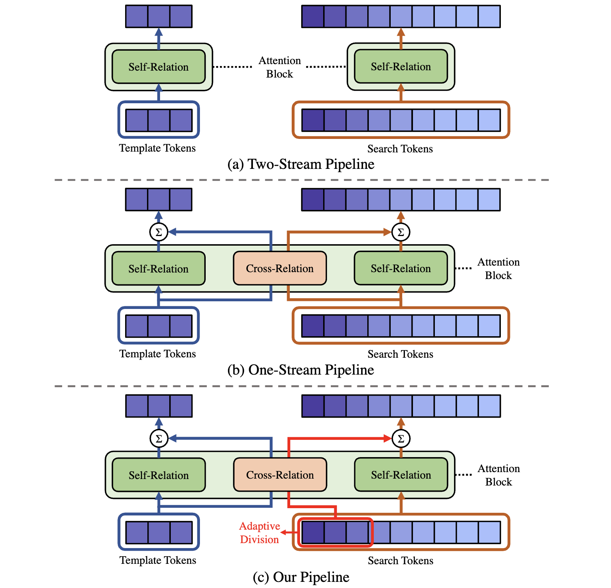

# GRM

The official PyTorch implementation of our **CVPR 2023** paper:

**Generalized Relation Modeling for Transformer Tracking**

[Shenyuan Gao](https://github.com/Little-Podi), [Chunluan Zhou](https://www.sites.google.com/view/chunluanzhou), [Jun Zhang](https://eejzhang.people.ust.hk)

[[CVF Open Access](https://openaccess.thecvf.com/content/CVPR2023/html/Gao_Generalized_Relation_Modeling_for_Transformer_Tracking_CVPR_2023_paper.html)] [[ArXiv Preprint](https://arxiv.org/abs/2303.16580)] [[YouTube Video](https://youtu.be/bQKN3HV-8XI)] [[Trained Models](https://github.com/Little-Podi/GRM/releases/tag/downloads)] [[Raw Results](https://github.com/Little-Podi/GRM/releases/tag/downloads)] [[SOTA Paper List](https://github.com/Little-Podi/Transformer_Tracking)]

## Highlight



### :bookmark:Brief Introduction

Compared with previous two-stream trackers, the recent one-stream tracking pipeline, which allows earlier interaction between the template and search region, has achieved a remarkable performance gain. However, existing one-stream trackers always let the template interact with all parts inside the search region throughout all the encoder layers. This could potentially lead to target-background confusion when the extracted feature representations are not sufficiently discriminative. To alleviate this issue, we propose **generalized relation modeling** (GRM) based on adaptive token division. The proposed method is a generalized formulation of attention-based relation modeling for Transformer tracking, which inherits the merits of both previous two-stream and one-stream pipelines whilst enabling more flexible relation modeling by selecting appropriate search tokens to interact with template tokens.

### :bookmark:Strong Performance

|             Variant             |         GRM-GOT         |           GRM           |        GRM-L320         |
| :-----------------------------: | :---------------------: | :---------------------: | :---------------------: |
|          Model Config           | ViT-B, 256^2 resolution | ViT-B, 256^2 resolution | ViT-L, 320^2 resolution |
|        Training Setting         |  only GOT, 100 epochs   | 4 datasets, 300 epochs  | 4 datasets, 300 epochs  |
| GOT-10k (AO / SR 0.5 / SR 0.75) |   73.4 / 82.9 / 70.4    |            -            |            -            |
|    LaSOT (AUC / Norm P / P)     |            -            |   69.9 / 79.3 / 75.8    |   71.4 / 81.2 / 77.9    |
| TrackingNet (AUC / Norm P / P)  |            -            |   84.0 / 88.7 / 83.3    |   84.4 / 88.9 / 84.0    |
|    AVisT (AUC / OP50 / OP75)    |            -            |   54.5 / 63.1 / 45.2    |   55.1 / 63.8 / 46.9    |
|           NfS30 (AUC)           |            -            |          65.6           |          66.0           |
|          UAV123 (AUC)           |            -            |          70.2           |          72.2           |

### :bookmark:Inference Speed

Our baseline model (backbone: ViT-B, resolution: 256x256) can run at **45 fps** (frames per second) on a single NVIDIA GeForce RTX 3090.

### :bookmark:Training Cost

It takes **less than half a day** to train our baseline model for 300 epochs on 8 NVIDIA GeForce RTX 3090 (each of which has 24GB GPU memory).

## Release

**Trained Models** (including the baseline model GRM, GRM-GOT and a stronger variant GRM-L320) [[download zip file](https://github.com/Little-Podi/GRM/releases/download/downloads/Trained_Models.zip)]

**Raw Results** (including raw tracking results on six datasets we benchmarked in the paper and listed above) [[download zip file](https://github.com/Little-Podi/GRM/releases/download/downloads/Raw_Results.zip)]

Download and unzip these two zip files into the `output` directory under GRM project path, then both of them can be directly used by our code.

## Let's Get Started

- ### Environment

  Our experiments are conducted with Ubuntu 20.04 and CUDA 11.6.

- ### Preparation

  - Clone our repository to your local project directory.

  - Download the pre-trained weights from [MAE](https://github.com/facebookresearch/mae) or [DeiT](https://github.com/facebookresearch/deit/blob/main/README_deit.md), and place the files into the `pretrained_models` directory under GRM project path. You may want to try different pre-trained weights, so I list the links of pre-trained models integrated in this project.

    | Backbone Type |                   Model File                   |                       Checkpoint Link                        |
    | :-----------: | :--------------------------------------------: | :----------------------------------------------------------: |
    |  'vit_base'   |          'mae_pretrain_vit_base.pth'           | [download](https://dl.fbaipublicfiles.com/mae/pretrain/mae_pretrain_vit_base.pth) |
    |  'vit_large'  |          'mae_pretrain_vit_large.pth'          | [download](https://dl.fbaipublicfiles.com/mae/pretrain/mae_pretrain_vit_large.pth) |
    |  'vit_base'   |      'deit_base_patch16_224-b5f2ef4d.pth'      | [download](https://dl.fbaipublicfiles.com/deit/deit_base_patch16_224-b5f2ef4d.pth) |
    |  'vit_base'   | 'deit_base_distilled_patch16_224-df68dfff.pth' | [download](https://dl.fbaipublicfiles.com/deit/deit_base_distilled_patch16_224-df68dfff.pth) |

  - Download the training datasets ([LaSOT](http://vision.cs.stonybrook.edu/~lasot/download.html), [TrackingNet](https://github.com/SilvioGiancola/TrackingNet-devkit), [GOT-10k](http://got-10k.aitestunion.com/downloads), [COCO2017](https://cocodataset.org/#download)) and testing datasets ([NfS](http://ci2cv.net/nfs/index.html), [UAV123](https://cemse.kaust.edu.sa/ivul/uav123), [AVisT](https://sites.google.com/view/avist-benchmark)) to your disk, the organized directory should look like:

    ```
    --LaSOT/
    	|--airplane
    	|...
    	|--zebra
    --TrackingNet/
    	|--TRAIN_0
    	|...
    	|--TEST
    --GOT10k/
    	|--test
    	|--train
    	|--val
    --COCO/
    	|--annotations
    	|--images
    --NFS30/
    	|--anno
    	|--sequences
    --UAV123/
    	|--anno
    	|--data_seq
    --AVisT/
    	|--anno
    	|--full_occlusion
    	|--out_of_view
    	|--sequences
    ```

  - Edit the paths in `lib/test/evaluation/local.py` and `lib/train/adim/local.py` to the proper ones.

- ### Installation

  We use conda to manage the environment.

  ```
  conda create --name grm python=3.9
  conda activate grm
  bash install.sh
  ```
  
- ### Training

  - Multiple GPU training by DDP (suppose you have 8 GPU)

    ```
    python tracking/train.py --mode multiple --nproc 8
    ```

  - Single GPU debugging (too slow, not recommended for training)

    ```
    python tracking/train.py
    ```

  - For GOT-10k evaluation, remember to set `--config vitb_256_got_ep100`.

  - To pursuit performance, switch to a stronger variant by setting `--config vitl_320_ep300`.

- ### Evaluation

  - Make sure you have prepared the trained model.

  - LaSOT

    ```
    python tracking/test.py --dataset lasot
    ```
  
    Then evaluate the raw results using the [official MATLAB toolkit](https://github.com/HengLan/LaSOT_Evaluation_Toolkit).
  
  - TrackingNet
  
    ```
    python tracking/test.py --dataset trackingnet
    python lib/test/utils/transform_trackingnet.py
    ```
  
    Then upload `test/tracking_results/grm/vitb_256_ep300/trackingnet_submit.zip` to the [online evaluation server](https://eval.ai/web/challenges/challenge-page/1805/overview).
  
  - GOT-10k
  
    ```
    python tracking/test.py --param vitb_256_got_ep100 --dataset got10k_test
    python lib/test/utils/transform_got10k.py
    ```
  
    Then upload `test/tracking_results/grm/vitb_256_got_ep100/got10k_submit.zip` to the [online evaluation server](http://got-10k.aitestunion.com/submit_instructions).
  
  - NfS30, UAV123, AVisT
  
    ```
    python tracking/test.py --dataset nfs
    python tracking/test.py --dataset uav
    python tracking/test.py --dataset avist
    python tracking/analysis_results.py
    ```
  
  - For multiple threads inference, just add `--threads 40` after `tracking/test.py` (suppose you want to use 40 threads in total).
  
  - To show the immediate prediction results during inference, modify `settings.show_result = True` in `lib/test/evaluation/local.py` (may have bugs if you try this on a remote sever).
  
  - Please refer to [DynamicViT Example](https://github.com/raoyongming/DynamicViT/blob/master/viz_example.ipynb) for the visualization of search token division results.

## Acknowledgement

:heart::heart::heart:Our idea is implemented base on the following projects. We really appreciate their excellent open-source works!

- [OSTrack](https://github.com/botaoye/OSTrack) [[related paper](https://arxiv.org/abs/2203.11991)]
- [AiATrack](https://github.com/Little-Podi/AiATrack) [[related paper](https://arxiv.org/abs/2207.09603)]
- [DynamicViT](https://github.com/raoyongming/DynamicViT) [[related paper](https://arxiv.org/abs/2106.02034)]
- [PyTracking](https://github.com/visionml/pytracking) [[related paper](https://arxiv.org/abs/2208.06888)]

## Citation

If any parts of our paper and code help your research, please consider citing us and giving a star to our repository.

```
@inproceedings{gao2023generalized,
  title={Generalized Relation Modeling for Transformer Tracking},
  author={Gao, Shenyuan and Zhou, Chunluan and Zhang, Jun},
  booktitle={Proceedings of the IEEE/CVF Conference on Computer Vision and Pattern Recognition},
  pages={18686--18695},
  year={2023}
}
```

## Contact

If you have any questions or concerns, feel free to open issues or directly contact me through the ways on my GitHub [homepage](https://github.com/Little-Podi). Suggestions and collaborations are also highly welcome!
